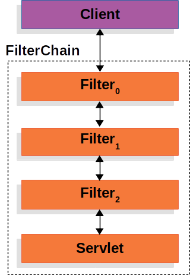

# Spring Security 아키텍처와 인증 프로세스

## 1. Spring Security
스프링 기반 애플리케이션의 인증과 인가를 담당하는 프레임워크이다. 이를 사용하면 개발자가 일일이 보안 로직을 구현할 필요 없이, 미리 설계 해둔 보안 체계를 활용하여 안전하고 손쉽게 웹 애플리케이션의 보안 로직을
적용할 수 있게 된다.

---

## 2. 핵심 동작 원리: Filter Chain
스프링 시큐리티는 기본적으로 서블릿 필터를 기반으로 동작한다. 따라서 클라이언트의 요청이 컨트롤러에 닿기전에 여러 단계의 필터를 거치며 단계별로 검증을 수행한다.

- 그림을 보면 알 수 있듯이 여러 필터를 통과하며 검증을 수행하는것을 알 수 있다. 마치 원유를 받아와서 정유탑에서 정제하여 단계적으로 필요한것들을 뽑아내듯이 각 필터가 인증, 인가, 취약점 방어등을 순차적으로 처리함을 알 수 있다.
- DelegatingFilterProxy
  - 서블릿 컨테이너와 스프링 컨테이너 사이의 다리(대리자)역할을 한다. 서블릿 필터로 등록되어 요청을 가로챈 뒤, 실제 보안 로직을 가진 스프링 bean인 FilterChainProxy에게 처리를 위임한다. 이 때문에 보안 계층에서도 스프링의 의존성 주입(DI) 기능을 활용할 수 있게 된다.

---

## 3. 인증의 상세 흐름과 핵심 모듈

스프링 시큐리티 구조의 처리 흐름은 다음과 같다.
1. 사용자가 로그인 정보와 함께 인증 요청을 한다.(Http Request)
2. AuthenticationFilter가 요청을 가로채고, 가로챈 정보를 통해 UsernamePasswordAuthenticationToken의 인증용 객체를 생성한다.
3.  AuthenticationManager의 구현체인 ProviderManager에게 생성한 UsernamePasswordToken 객체를 전달한다. 
4.  AuthenticationManager는 등록된 AuthenticationProvider(들)을 조회하여 인증을 요구한다. 
5. 실제 DB에서 사용자 인증정보를 가져오는 UserDetailsService에 사용자 정보를 넘겨준다. 
6. 넘겨받은 사용자 정보를 통해 DB에서 찾은 사용자 정보인 UserDetails 객체를 만든다. 
7.  AuthenticationProvider(들)은 UserDetails를 넘겨받고 사용자 정보를 비교한다. 
8.  인증이 완료되면 권한 등의 사용자 정보를 담은 Authentication 객체를 반환한다. 
9. 다시 최초의 AuthenticationFilter에 Authentication 객체가 반환된다. 
10. Authenticaton 객체를 SecurityContext에 저장한다.
   

최종적으로 SecurityContextHolder는 세션 영역에 있는 SecurityContext에 Authentication 객체를 저장한다.사용자 정보를 저장한다는 것은 Spring Security가 전통적인 세션-쿠키 기반의 인증 방식을 사용한다는 것을 의미한다.


사용자가 로그인을 시도할 때 코드 내부에서 일어나는 구체적인 과정은 다음과 같다.
1. Authentication & UserDetails
Authentication은 인증된 사용자의 정보를 담는 바구니이고, UserDetails는 DB에서 가져온 사용자 정보를 시큐리티 규격에 맞게 포장한 객체이다.

```Java
// UserDetails 구현체 예시
public class CustomUserDetails implements UserDetails {
    private String username;
    private String password;
    private List<GrantedAuthority> authorities;

    @Override
    public Collection<? extends GrantedAuthority> getAuthorities() { return authorities; }
    @Override
    public String getPassword() { return password; }
    @Override
    public String getUsername() { return username; }
    // ... 계정 상태 체크 메서드 생략
}
```
2. AuthenticationManager (ProviderManager)
모든 인증 요청의 총괄 매니저. 여러 AuthenticationProvider 중 적절한 기술자를 찾아 인증 진행.

3. AuthenticationProvider
아이디와 비밀번호가 맞는지 대조하고, 성공 시 최종 인증 객체를 생성.
```java
@Component
public class CustomAuthenticationProvider implements AuthenticationProvider {
    @Override
    public Authentication authenticate(Authentication auth) throws AuthenticationException {
        // ID/PW 대조 로직 및 성공 시 UsernamePasswordAuthenticationToken 반환
    }
    @Override
    public boolean supports(Class<?> authentication) {
        return UsernamePasswordAuthenticationToken.class.isAssignableFrom(authentication);
    }
}
```
4. UserDetailsService
DB에서 정보를 꺼내오는 역할을 전담합니다. 우리가 가장 자주 커스텀하는 핵심 인터페이스.
```java
@Service
public class CustomUserDetailsService implements UserDetailsService {
    @Override
    public UserDetails loadUserByUsername(String username) {
        // UserRepository를 사용하여 DB 조회 후 UserDetails 반환
    }
}
```
5. SecurityContextHolder
인증이 성공하면 그 결과물인 Authentication 객체는 SecurityContextHolder에 저장.

ThreadLocal 사용: 각 요청(스레드)마다 독립된 전용 사물함을 제공하여 사용자 정보 섞임을 방지.

격리성 & 편의성: 멀티스레드 환경에서도 안전하며, 코드 어디서든 파라미터 없이 로그인 정보를 꺼낼 수 있다.

```Java
// 로그인 정보 꺼내기
Authentication auth = SecurityContextHolder.getContext().getAuthentication();
```
6. ExceptionTranslationFilter
보안 필터 체인 상단에서 대기하다가 발생하는 에러를 잡는 비상구 역할.
- 인증되지 않은 사용자: AuthenticationEntryPoint를 통해 로그인 페이지로 안내.
- 권한이 없는 사용자: AccessDeniedHandler를 통해 403 에러 등을 처리.